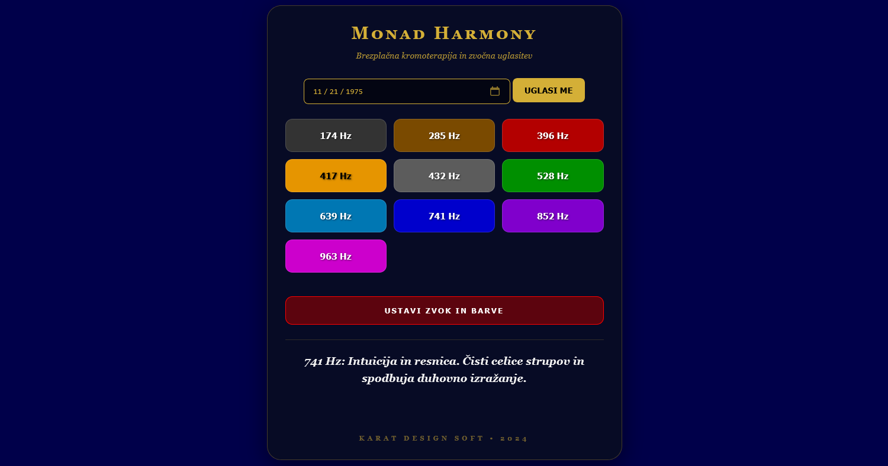

# 🕊️ Monad Harmony

  <b>✨ Click the banner above to launch Monad Harmony ✨</b>

---

## 📱 Install as a Mobile App (PWA)
Monad Harmony is a **Progressive Web App**, meaning you can install it on your phone for a full-screen, ad-free experience without using an App Store.

### **For iPhone (iOS):**
1. Open the [App Link](https://github.io) in **Safari**.
2. Tap the **Share** button (square with an arrow).
3. Scroll down and select **"Add to Home Screen"**.

### **For Android:**
1. Open the [App Link](https://github.io) in **Chrome**.
2. Tap the **three dots (⋮)** in the top right corner.
3. Select **"Install app"** or **"Add to Home screen"**.

---

🏛️ Tetragrammaton Resurrection Source

Decoding the Geometry of Existence through Code & Frequency

Welcome. I develop tools that bridge the gap between ancient analytical wisdom and modern digital utility. My work focuses on mental clarity, biological resonance, and structural logic, providing clean, ad-free environments for human optimization.

🌌 Current Featured Project: Monad Harmony

A minimalist analytical sanctuary that synchronizes:

    Numerical Biology: Calculating personal cycles and lunar resonance.
    Acoustic Therapy: Utilizing 10 pure Solfeggio frequencies for neural alignment.
    Guided Coherence: Integrating visual breathwork with bio-rhythmic data.

🛠️ My Philosophy

    No Noise: My applications are strictly ad-free and cost-free.
    Privacy-Centric: Data belongs to the user, processed locally.
    Minimalist Design: Functionality over distraction.

💬 Feedback & Collaboration

I am constantly refining the algorithms and user experience of my tools. If you are using Monad Harmony, I value your insight. Feel free to open an Issue or start a Discussion here on GitHub to share your experience or suggest enhancements.

"Everything is a number. Everything is resonance."
Monad Harmony is a comprehensive web application designed for the holistic alignment of body and spirit. It merges ancient frequency wisdom, color therapy, and lunar cyclicity within an elegant, user-friendly interface.
🌟 Key Features

    Solfeggio Sound Therapy: A full spectrum of 9 therapeutic frequencies (from 174 Hz to 963 Hz) + the natural 432 Hz tuning.
    Interactive Chromotherapy: Dynamic full-screen ambient color shifts based on the selected frequency for deep visual relaxation.
    Lunar & Biological Calculator: Calculate lunar years and precise biological maturation cycles (based on 266-day cycles).
    Frequency Wisdom: An integrated guide providing detailed descriptions of how each specific frequency impacts the body and mind.
    Glassmorphism Design: A modern, premium aesthetic featuring a gold-and-black palette with translucent elements.

🛠 Technologies

    HTML5 & CSS3: Responsive design utilizing glassmorphism effects and smooth color transitions.
    JavaScript (Web Audio API): Generation of pure sine waves directly in the browser without external audio files.
    Open Graph Protocol: Optimized for professional sharing across social media platforms (Facebook, WhatsApp).

🚀 Usage
The application is completely free and runs directly in your browser with no installation required.
Access the app: https://tetragrammatonresurrection-source.github.io/monad-harmony/
🎨 Authorship
Created under the auspices of Karat Design Soft.
